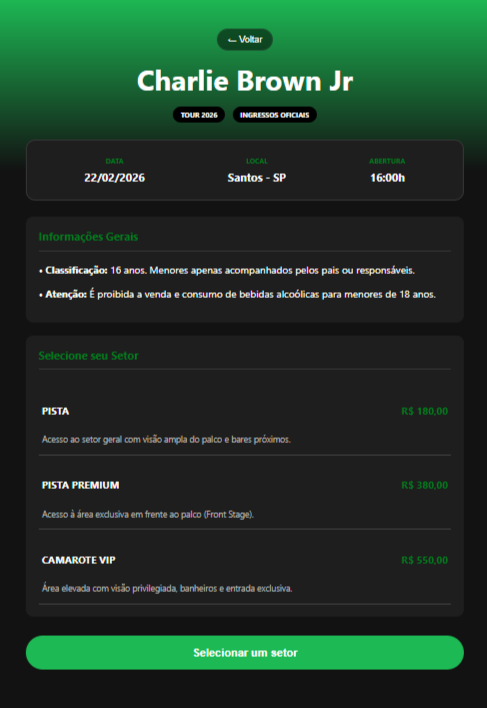
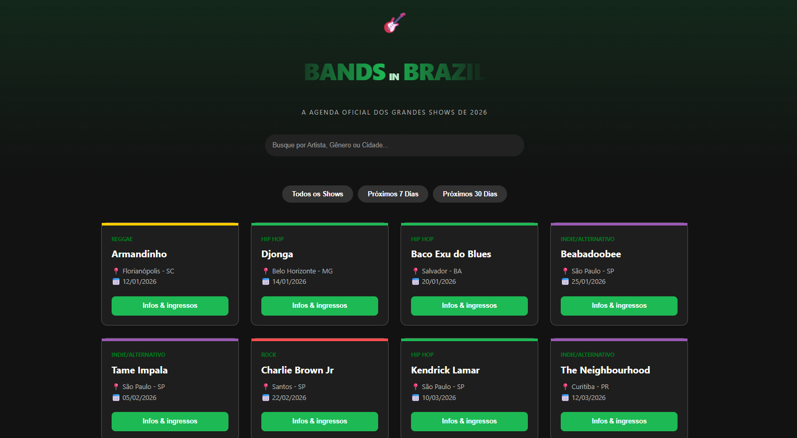

# 🎸 BANDS IN BRAZIL 2026

O **Bands In Brazil** é um sistema de agenda e reserva de ingressos para shows. O projeto simula uma plataforma real de eventos com foco em usabilidade e performance, entregando uma experiência fluida e intuitiva ao usuário.

O sistema organiza uma agenda com 24 shows para o ano de 2026, permitindo buscas por artista, gênero ou cidade. Possui filtros de data e um processo de compra que permite escolher entre os setores Pista, Pista Premium ou VIP, calculando taxas automaticamente.

  
  
  &nbsp;

## 🚀 Funcionalidades Principais

- **Agenda Inteligente**: Listagem de shows organizada automaticamente por ordem cronológica.
- **Busca Multi-critério**: Pesquisa por Artista, Gênero Musical ou Cidade.
- **Filtros Temporais**: Botões de acesso rápido para eventos nos próximos 7 e 30 dias.
- **Branding Dinâmico**: Logo animada com efeitos de gradiente e pulso via CSS puro.
- **Checkout Responsivo**: 
  - Seleção de setores (Pista, Pista Premium e VIP).
  - Cálculo automático de taxa de conveniência (10%).
  - Persistência de dados via LocalStorage.

## ⚙️ Como Executar

### Pré-requisitos
* [Git](https://git-scm.com/) instalado

### Passo a Passo

1. **Clonar o projeto:** No terminal, execute `git clone https://github.com/Ana-Maria-Lange/Bands_In_Brazil_JAVA_JS.git` e entre na pasta com `cd Bands_In_Brazil_JAVA_JS`.
2. **Abrir no editor:** Digite `code .` para abrir o projeto no VS Code.
3. **Executar a aplicação:** Abra o arquivo `web/index.html` diretamente no navegador ou utilize o *Live Server* do VS Code.

> **Nota:** O código-fonte em Java encontra-se na pasta `src/`.
